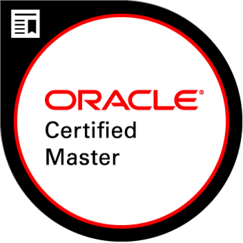

# SCEA-OCMJEA
This is my complete Sun Certified Enterprise Architect EE5 assignment submission.

I have decided to publish it now, a few years after achieving the SCEA certification, since almost all the technical details are obsolete, and therefore there is no risk of compromising the value of this certification.

* [My credentials](https://www.youracclaim.com/badges/1add221c-dc18-4f4e-9dd1-3c73b95cfbf8)
* [Sun original assignment documentation](https://rawgit.com/idelvall/SCEA-OCMJEA/master/scea-SR1825921/Assignment/1.htm)
* [My SCEA submission](https://rawgit.com/idelvall/SCEA-OCMJEA/master/scea-SR1825921/index.html)

